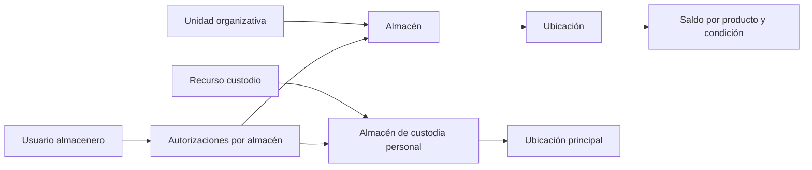

# Implementación de inventario por ubicaciones y custodia personal

Actualizado: 3 de octubre de 2026. Sustituye la propuesta anterior. La descarga y liquidación de material por trabajos realizados quedan diferidas hasta desarrollar Servicio de Campo.

## Modelo definitivo

El almacén es una unidad lógica de control de inventario. La ubicación pertenece a un almacén y determina dónde se registra el saldo. La custodia personal representa al responsable del material aunque trabaje a pie o lo guarde en casa.

| Entidad | Responsabilidad |
|---|---|
| UnidadOrganizativa | Pertenencia logística: Trujillo, Chiclayo, etc. |
| Almacen | Control del inventario; tipo Bodega o CustodiaPersonal |
| UbicacionInventario | Punto de registro del stock dentro de un solo almacén |
| Recurso | Persona operativa que recibe material y órdenes; usuario opcional |
| Usuario | Acceso y autoría de las operaciones |
| UsuarioAlmacenAutorizacion | Consulta, despacho, recepción y supervisión por almacén |
| StockAlmacen | Saldo por producto + ubicación + condición |
| ItemSeriado | Serie con ubicación actual o transferencia en tránsito |
| Transferencia | Documento de envío entre ubicaciones |
| RecepcionTransferencia | Cantidades y series que efectivamente llegaron |
| ResolucionDiferenciaTransferencia | Regularización del pendiente con supervisor y evidencia |
| MovimientoInventario | Efecto confirmado sobre el inventario y su auditoría |

Se conserva el nombre de clase StockAlmacen, pero su dimensión física pasa a ser UbicacionId. El almacén se deriva de la ubicación. Cada almacén nuevo recibe una ubicación Principal automáticamente.

## Tipos de almacén

Se mantienen Bodega = 1 y CustodiaPersonal = 2. Sirven para aplicar reglas de abastecimiento, devolución y traslado entre unidades, y exigir el recurso custodio. El tipo no otorga permisos.

No se crean tipos Casa, Mochila o Camioneta para representar a la persona. Esos conceptos podrían describir una ubicación o activo cuando exista una necesidad posterior. No se usa una jerarquía padre–hijo de almacenes para inferir simultáneamente pertenencia, abastecimiento y permisos.

## Recurso, custodia y usuario

Recurso permanece separado de Usuario. Permite custodios sin cuenta de acceso y usuarios administrativos sin campos técnicos vacíos. El vínculo opcional con un usuario no concede facultades para mover stock.

Almacen.RecursoId es la relación canónica de custodia. Un recurso técnico activo puede tener una sola custodia personal activa y debe pertenecer a su misma unidad. Recurso.AlmacenMovilId deja de persistirse en EF; el contrato de lectura conserva temporalmente ese nombre como valor derivado para compatibilidad. Las solicitudes de edición del recurso ya no cambian esa relación.

El tipo, la unidad y el custodio del almacén existente se conservan. Para cambiar la responsabilidad se devuelve o transfiere material, se desactiva la custodia anterior y se crea la nueva. Un recurso con custodia activa tampoco cambia de unidad o deja de ser técnico mediante una edición ordinaria.

La bodega puede tener varios usuarios autorizados y un usuario puede gestionar varios almacenes. Su administración no se representa con un único recurso encargado.

## Movimientos y permisos

Despacho, abastecimiento, devolución, desabastecimiento y traslado comparten el mecanismo de transferencia entre ubicaciones. El propósito cambia según origen y destino. La recepción es un evento posterior cuando existe tránsito.

| Origen → destino | Regla |
|---|---|
| Bodega → custodia personal | Misma unidad organizativa |
| Custodia personal → bodega | Misma unidad; lo registra el almacenero |
| Bodega → bodega de otra unidad | Tránsito y recepción en destino obligatorios |
| Bodega → bodega de la misma unidad | Inmediata o con tránsito según la entrega |
| Ubicación → otra ubicación del mismo almacén | Ubicaciones diferentes |
| Custodia personal → otra custodia personal | Retornar primero a bodega y luego abastecer |
| Chiclayo → técnico de Trujillo | Prohibido; primero trasladar y recepcionar en bodega Trujillo |

El técnico puede transportar físicamente material entre sedes, pero no se incorpora a su custodia hasta que su bodega lo reciba y el almacenero lo abastezca.

No se exige aprobación previa para despachar. Se exige autorización de despacho en origen. La modalidad inmediata registra salida e ingreso juntos y exige permiso de recepción en destino al mismo operador. Con tránsito, el destino recibe mediante su propia autorización. La autorización del origen no concede recepción en destino.

Si una persona administra los dos almacenes, puede tener ambas facultades; no se exige otro usuario para recibir. Entre unidades se conservan siempre eventos separados.

Las consultas de existencias y series se limitan al alcance del usuario. El selector de destinos muestra metadatos de almacenes compatibles, incluyendo bodegas de otras unidades, sin habilitar consulta de su stock.

SuperAdmin y ServicioCampoAdmin administran las autorizaciones. Un supervisor de almacén no se eleva permisos ni delega acceso por sí mismo. Se valida que el usuario exista y esté activo; las facultades operativas requieren consulta. SuperAdmin conserva acceso global. Ser técnico o custodio no concede ninguna autorización automática.

## Stock, condición y tránsito

Una combinación producto–ubicación–condición tiene un único saldo. Las condiciones iniciales son Utilizable y Defectuoso, separadas del estado logístico del envío.

Para los seriados, el saldo agregado y las unidades se actualizan en la misma transacción. Una serie está en una ubicación vigente o en tránsito identificado por TransferenciaEnTransitoId. Durante el tránsito UbicacionActualId permanece vacío.

El despacho con tránsito descuenta el disponible del origen. El destino aumenta solo lo recibido. El pendiente pertenece al documento, sin crear un almacén ficticio de tránsito. No está disponible para despacho ni liquidación.

Pendiente = Enviada − Recibida − Resuelta. No se admite recibir o regularizar más que el pendiente ni ocultar errores convirtiendo un resultado negativo a cero.

El selector de stock excluye tránsito. La trazabilidad de series puede mostrar los envíos pendientes cuyo origen o destino estén dentro del alcance del usuario.

## Pantallas y captura

La pantalla de movimientos selecciona almacenes, ubicaciones, modalidad y condición. El servidor vuelve a validar que las ubicaciones pertenezcan a esos almacenes.

Para seriados se captura una serie por unidad y se valida producto, condición y ubicación de origen. Para no seriados se captura SKU y cantidad.

La recepción inicia las cantidades en cero. Capturar una serie recibe solo esa serie pendiente; capturar SKU y cantidad recibe solo lo ingresado. Se rechazan duplicados, series ajenas y cantidades superiores al pendiente. Cada serie recibida se vincula con el detalle de recepción correspondiente.

La ficha de almacén permite consultar y crear ubicaciones y administrar autorizaciones según permisos. El inventario muestra ubicación y condición. El detalle de transferencia conserva las ubicaciones, la condición, la unidad del despacho y los saldos recibidos, regularizados y pendientes. El historial muestra las capturas de recepción y las regularizaciones con evidencia.

Las cantidades se registran en la unidad predeterminada de inventario del producto, con hasta cinco decimales según su configuración. Los seriados requieren enteros. La unidad de los despachos nuevos se conserva en su detalle. Se bloquean cambios de unidad, tipo, seriado y precisión después de utilizar el producto en inventario.

Esta entrega mantiene una sola unidad para registrar stock; no introduce aún captura en unidades alternativas ni conversiones de cajas, bolsas o bobinas. Los detalles históricos sin unidad registrada conservan ese dato desconocido.

## Recepciones con diferencias

Si se envían diez unidades y llegan ocho, se incorporan ocho al destino y dos permanecen pendientes. El supervisor verifica y registra cantidad, series cuando corresponde, motivo y referencia de evidencia:

1. Restitución al origen: incorpora el material comprobado en origen; requiere supervisión en ambos almacenes.
2. Ingreso comprobado en destino: incorpora el material encontrado en destino.

Que el material no haya llegado no prueba que siga en origen. La restitución requiere verificación. La resolución agrega un evento; no borra el envío original.

El dominio conserva los resultados previos de pérdida y daño. La API los reconoce para regularizaciones justificadas de tránsito: pérdida no aumenta ningún almacén; daño incorpora condición Defectuoso en destino. La interfaz inicial presenta las dos alternativas acordadas de origen y destino. No se amplían los flujos específicos de baja, reparación o recuperación de campo.

## Consistencia y auditoría

- Despacho, recepción y resolución se ejecutan en transacciones; una línea fallida revierte saldos, series, documentos y movimientos del evento.
- Saldos, series, transferencias y líneas utilizan concurrencia optimista con xmin de PostgreSQL.
- Los índices únicos impiden duplicar saldos, operaciones, ubicaciones principales y custodias activas.
- Cada confirmación recibe un OperacionId estable. Reintentar con el mismo contenido devuelve el resultado anterior; reutilizarlo para otro contenido se rechaza.
- Se conservan fecha real y fecha de registro. La fecha real opcional se envía en UTC y no admite fechas futuras salvo una tolerancia breve de reloj.
- Una fecha real anterior no habilita stock retroactivo: el disponible cambia al confirmar el evento.
- Los movimientos guardan usuario, documento, evento, transferencia y ubicaciones aplicables. La resolución conserva supervisor, motivo y evidencia.
- No se desactivan almacenes o ubicaciones con stock o transferencias pendientes. Principal permanece activa.

## Migración

El SQL está en src/Modules/ServicioCampo/BubbaBag.Modules.ServicioCampo.Infrastructure/Database/Migrations/Sql/inventario-ubicaciones.sql. MigracionUbicacionesInventario lo ejecuta dentro de una transacción al arrancar, antes de los sembradores. Después asegura Principal para los almacenes creados por los sembradores.

La versión registrada evita repetir las transformaciones. Se comprueban custodias activas duplicadas, cantidades frente a series, tránsitos identificables, pendientes contradictorios y coincidencia de saldos seriados sin reservas pendientes de conciliar. Las inconsistencias detienen la migración con un mensaje específico.

El stock actual se asigna a Principal y se separa por condición. Los documentos abiertos reciben Principal para continuar. Los documentos cerrados y movimientos históricos mantienen ubicación desconocida si no se registró originalmente. No se inventan ubicaciones ni unidades históricas usando el catálogo actual.

Se corrige exclusivamente la marca pendiente de series de transferencias inmediatas cerradas, cuyo total ya fue recibido. Las diferencias antiguas de recepciones parciales requieren conciliación; no se eligen series automáticamente.

Las columnas antiguas permanecen temporalmente para compatibilidad y auditoría, pero dejan de ser fuente del stock actual. El listado combina documentos nuevos con movimientos históricos sin documento equivalente, para que un despacho nuevo no oculte el historial anterior.

**La base habitual no se modificó durante este trabajo.** Antes de arrancar esta versión sobre ella, conservar respaldo y ensayar la migración en una copia. Si hay inconsistencias, resolver los registros señalados antes de reintentar. Las pruebas sintéticas no reemplazan la conciliación de datos reales.

El proyecto mantiene su mecanismo existente de migraciones EF más complementos SQL de arranque. Este complemento usa VersionesInventario. Los cambios futuros deben incorporar estas dimensiones al generar migraciones EF; no reconstruirlas desde un snapshot antiguo ignorando el SQL de arranque.

## Verificación

Los cambios principales están en dominio de Almacenes y Productos, InventarioAcceso, InventarioSaldos, comandos de despacho/recepción/resolución, consultas de inventario, UbicacionesEndpoints, AlmacenesEndpoints y sus pantallas de React.

Las pruebas están en tests/Compras.Workflow/InventarioWorkflow.cs y tests/Inventario.Migrations. Cubren reglas entre unidades, abastecimiento y devolución locales, ubicaciones ajenas, series exactas, tránsito, recepciones parciales, regularización, permisos y reintentos. PostgreSQL comprueba además rollback y conflictos de concurrencia. La migración se prueba con un esquema anterior sintético, conservación de stock y precisión, condiciones, tránsito, historial desconocido y ejecución repetida.

Ejecutar las pruebas de flujo con dotnet run --no-restore --project tests/Compras.Workflow/Compras.Workflow.csproj. Para PostgreSQL establecer INVENTARIO_TEST_CONNECTION apuntando exclusivamente a una base nueva y vacía de pruebas: el ejecutor crea su esquema con EnsureCreated. No usar la base habitual ni una copia con datos existentes.

La prueba de migración usa legacy-fixture.sql, el SQL de migración y verify-migration.sql en otra base de pruebas, ejecutando psql con transacción única y errores fatales: -1 -v ON_ERROR_STOP=1.

La interfaz se verifica con TypeScript y el build de producción de Vite. El uso completo en navegador con API nueva requiere arrancar la versión sobre una base conciliada; no se verificó ese arranque sobre tus datos reales.

## Servicio de Campo diferido

No se conectan instalaciones, retiros, consumo o liquidación de órdenes al nuevo saldo en esta entrega. Las estructuras previas de Servicio de Campo se conservan para adaptarlas cuando se desarrolle ese flujo.

En esa etapa, la descarga identificará custodia/ubicación, recurso, trabajo realizado y cantidad o serie, respetando condición, permisos, transacciones y exclusión del tránsito. Esta sección describe integración futura y no habilita descargas ahora.
